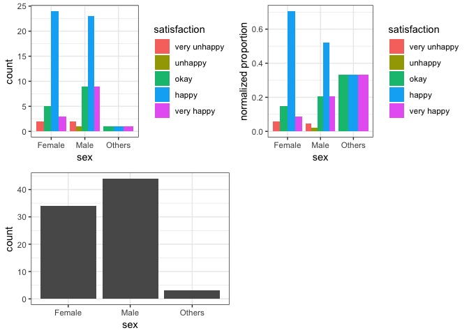
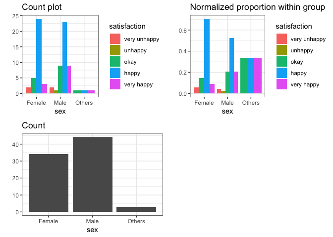
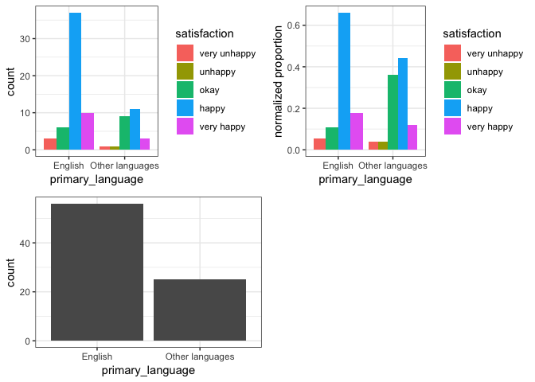
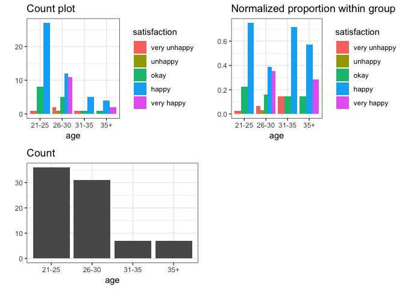

Milestone 2: EDA for Survey Results
================

Survey Design:
--------------

We designed our survey based on our proposal: [MDS Program Satisfaction Survey](https://docs.google.com/forms/d/e/1FAIpQLSen3J_qhrALM8JovRQPo0KoHIKeoBqauHTrYQbwaC0DM8XFfA/viewform). The survey results were then collected automatically and EDAs were performed based on each predictor. The will be three different plot for the EDA:

> 1.  Count based grouped bar chart, which represents the direct count of number of people give specific response;
> 2.  Proportion based grouped bar chat, which represents the normalized proportion for people with in each level of predictor, e.g. for all females or all males;
> 3.  Distribution of the predictor, which reflect the balance/unbalance of the collect data.

EDA: visualization and interpretation
-------------------------------------

(The source codes for data cleaning, preprocessing and visualization function design are not included in this report considering the report length. They can be accessed [here](Milestone_2_EDA.Rmd))

### Predictor: Sex

``` r
Visualization(data, "sex")
```

    ## Joining, by = "predictor"



**Interpretation**:
The bar charts above illustrate a few things. The number of Male to Female candidates were close to even, with 3 candidates choosing NA, other, or not to answer. These 3 have been grouped together as "others". A vast majority of the candidates of both Male and Female sex selected "happy" as their satisfaction level. Approximately 95% of the "Female" candidates appeaer to have slected okay or higher on the satisfaction level, while approx 93% of the "Male" candidates exhibited the samee behavior.

Predictor: Age
--------------

``` r
Visualization(data, "age")
```

    ## Joining, by = "predictor"



**Interpretation**:
The count plot indidactes that the student base at MDS is certainly leaning towards the younger side. However, the normalized proportions of satisfaction show that all age groups are enjyoing the program. Interestinglt, the age-group of 26-30 has the most number of "very happy" candidates both propotionally and as an over all count, while none of the 21-25 year old candidates selected "very happy" inspite of being the largest group.

Prediction: Primary\_language
-----------------------------

``` r
Visualization(data,'primary_language')
```

    ## Joining, by = "predictor"



**Interpretation**:
The count plot above shows that there are 2 times as many native english speakers, than there are people with a primary language other than english. Amongst the candidates that selected english as their primary language, more than 60% of them feel happy about the MDS program. Both groups showcase a variation in satisfaction levels, however, most of the people - in both groups - seem to be be happy with program; less than 5% in each group rated their satisfaction with MDS as unhappy or very unhappy. Interestingly, however, candidates that said english was not their primary language had a larger proportion of people that had a neutral "okay" satisfaction with the MDS program.

Prediction: level\_education
----------------------------

``` r
Visualization(data,'level_education')
```

    ## Joining, by = "predictor"



**Interpretation**:
The bar plot above shows that approximately 75% of the students had completed a Bachelors degree prior to joining MDS, while the remaining had completed a Masters degreee or higher. 60% of the students of each of the two groups are happy with this program, and most of the other proportions of satisfactory levels look even across both groups. It doesn't seem like the level of prior education had an impact on the candidates satisfaction level.
