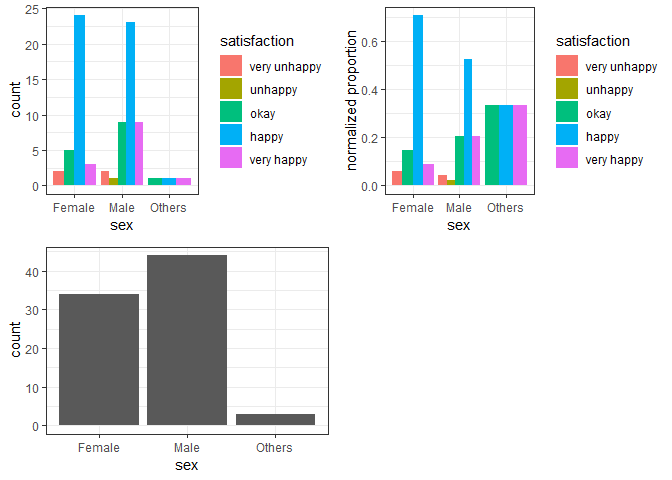
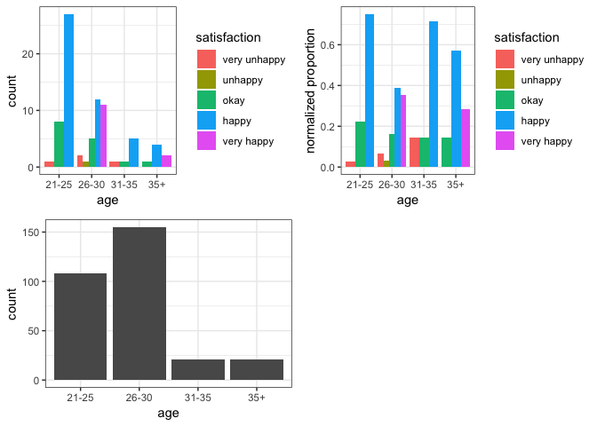

Milestone 2: EDA for Survey Results
================

## Survey Design:

We designed our survey based on our proposal: [MDS Program Satisfaction
Survey](https://docs.google.com/forms/d/e/1FAIpQLSen3J_qhrALM8JovRQPo0KoHIKeoBqauHTrYQbwaC0DM8XFfA/viewform).
The survey results were then collected automatically and EDAs were
performed based on each predictor. The will be three different plot for
the EDA:

> 1.  Count based grouped bar chart, which represents the direct count
>     of number of people give specific response;
> 2.  Proportion based grouped bar chat, which represents the normalized
>     proportion for people with in each level of predictor, e.g. for
>     all females or all males;
> 3.  Distribution of the predictor, which reflect the balance/unbalance
>     of the collect data.

## EDA: visualization and interpretation

(The source codes for data cleaning, preprocessing and visualization
function design are not included in this report considering the report
length. They can be accessed [here](Milestone_2_EDA.Rmd))

### Predictor: Sex

``` r
Visualization(data, "sex")
```

    ## Joining, by = "predictor"

<!-- -->

**Interpretation**:

## Predictor: Age

``` r
Visualization(data, "age")
```

    ## Joining, by = "predictor"

<!-- -->

**Interpretation**:
