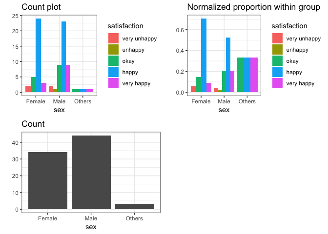
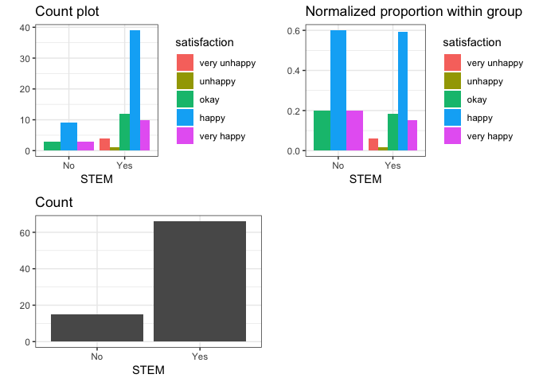

Report Draft
================

## Overall Summary

#### The interaction between predictors and response

``` r
# data_sub
model_overall <- glm(satisfaction_level ~ level_education, data = data_sub, family = 'poisson')
summary(model_overall)
```

    ## 
    ## Call:
    ## glm(formula = satisfaction_level ~ level_education, family = "poisson", 
    ##     data = data_sub)
    ## 
    ## Deviance Residuals: 
    ##      Min        1Q    Median        3Q       Max  
    ## -2.35850   0.06883   0.12950   0.12950   0.68531  
    ## 
    ## Coefficients:
    ##                         Estimate Std. Error z value Pr(>|z|)    
    ## (Intercept)              1.02290    0.07495  13.647   <2e-16 ***
    ## level_educationMasters+  0.03571    0.16133   0.221    0.825    
    ## ---
    ## Signif. codes:  0 '***' 0.001 '**' 0.01 '*' 0.05 '.' 0.1 ' ' 1
    ## 
    ## (Dispersion parameter for poisson family taken to be 1)
    ## 
    ##     Null deviance: 34.316  on 80  degrees of freedom
    ## Residual deviance: 34.268  on 79  degrees of freedom
    ## AIC: 265.54
    ## 
    ## Number of Fisher Scoring iterations: 4

#### The interaction between predictor, confonder and response

``` r
model_overall_conf <- glm(satisfaction_level ~ sex + age + level_education + STEM, data = data_sub, family = 'poisson')
summary(model_overall_conf)
```

    ## 
    ## Call:
    ## glm(formula = satisfaction_level ~ sex + age + level_education + 
    ##     STEM, family = "poisson", data = data_sub)
    ## 
    ## Deviance Residuals: 
    ##      Min        1Q    Median        3Q       Max  
    ## -2.40336  -0.16582   0.09389   0.21809   0.62996  
    ## 
    ## Coefficients:
    ##                          Estimate Std. Error z value Pr(>|z|)    
    ## (Intercept)              1.049514   0.181516   5.782 7.38e-09 ***
    ## sexMale                 -0.005601   0.140889  -0.040    0.968    
    ## sexOthers                0.105525   0.366422   0.288    0.773    
    ## age26-30                 0.089475   0.149293   0.599    0.549    
    ## age31-35                -0.112378   0.266672  -0.421    0.673    
    ## age35+                   0.155645   0.260735   0.597    0.551    
    ## level_educationMasters+ -0.006716   0.182241  -0.037    0.971    
    ## STEMYes                 -0.072797   0.172832  -0.421    0.674    
    ## ---
    ## Signif. codes:  0 '***' 0.001 '**' 0.01 '*' 0.05 '.' 0.1 ' ' 1
    ## 
    ## (Dispersion parameter for poisson family taken to be 1)
    ## 
    ##     Null deviance: 34.316  on 80  degrees of freedom
    ## Residual deviance: 33.018  on 73  degrees of freedom
    ## AIC: 276.29
    ## 
    ## Number of Fisher Scoring iterations: 4

#### Anova

## Confonders vs. Predictor

#### Age

We first explore the interaction between the age and our predictor of
interest.

``` r
Visualization(data_sub, "age", "predictor")
```

    ## Joining, by = "conf"

<!-- -->

As we can observe from the EDA, different age group has distinct pattern
for the proportion distribution of its own education level. For older
people, they are intended to have master degree than yourger ones.
However, we want to explore these pattern are significantly unique based
on the hypothesis that **if age can significantly influence the
predictor as a confunder**. Given that hypothesis, we set the age lower
than 26 being the control group and there is no significant different
between different age groups given the
p-value.

``` r
m <- glm_reg(data = data_sub, mode = "predictor", conf = "age", output = "summary")
m
```

    ## 
    ## Call:
    ## glm(formula = above_bachelor ~ confonder, family = "poisson", 
    ##     data = data_sub)
    ## 
    ## Deviance Residuals: 
    ##     Min       1Q   Median       3Q      Max  
    ## -1.0690  -0.7184  -0.4714  -0.4714   1.6176  
    ## 
    ## Coefficients:
    ##                Estimate Std. Error z value Pr(>|z|)    
    ## (Intercept)     -2.1972     0.5000  -4.394 1.11e-05 ***
    ## confonder26-30   0.8427     0.6124   1.376   0.1688    
    ## confonder31-35   0.2513     1.1180   0.225   0.8221    
    ## confonder35+     1.6376     0.7071   2.316   0.0206 *  
    ## ---
    ## Signif. codes:  0 '***' 0.001 '**' 0.01 '*' 0.05 '.' 0.1 ' ' 1
    ## 
    ## (Dispersion parameter for poisson family taken to be 1)
    ## 
    ##     Null deviance: 53.082  on 80  degrees of freedom
    ## Residual deviance: 47.619  on 77  degrees of freedom
    ## AIC: 89.619
    ## 
    ## Number of Fisher Scoring iterations: 6

#### Sex

We discover similar results in the sex
variable.

``` r
Visualization(data_sub, "sex", "predictor")
```

    ## Joining, by = "conf"

<!-- -->

``` r
m <- glm_reg(data = data_sub, mode = "predictor", conf = "age", output = "summary")
m
```

    ## 
    ## Call:
    ## glm(formula = above_bachelor ~ confonder, family = "poisson", 
    ##     data = data_sub)
    ## 
    ## Deviance Residuals: 
    ##     Min       1Q   Median       3Q      Max  
    ## -1.0690  -0.7184  -0.4714  -0.4714   1.6176  
    ## 
    ## Coefficients:
    ##                Estimate Std. Error z value Pr(>|z|)    
    ## (Intercept)     -2.1972     0.5000  -4.394 1.11e-05 ***
    ## confonder26-30   0.8427     0.6124   1.376   0.1688    
    ## confonder31-35   0.2513     1.1180   0.225   0.8221    
    ## confonder35+     1.6376     0.7071   2.316   0.0206 *  
    ## ---
    ## Signif. codes:  0 '***' 0.001 '**' 0.01 '*' 0.05 '.' 0.1 ' ' 1
    ## 
    ## (Dispersion parameter for poisson family taken to be 1)
    ## 
    ##     Null deviance: 53.082  on 80  degrees of freedom
    ## Residual deviance: 47.619  on 77  degrees of freedom
    ## AIC: 89.619
    ## 
    ## Number of Fisher Scoring iterations: 6

#### STEM

``` r
Visualization(data_sub, "STEM", "predictor")
```

    ## Joining, by = "conf"

<!-- -->

``` r
m <- glm_reg(data = data_sub, mode = "predictor", conf = "STEM", output = "summary")
m
```

    ## 
    ## Call:
    ## glm(formula = above_bachelor ~ confonder, family = "poisson", 
    ##     data = data_sub)
    ## 
    ## Deviance Residuals: 
    ##     Min       1Q   Median       3Q      Max  
    ## -0.6963  -0.6963  -0.6963  -0.3651   1.8840  
    ## 
    ## Coefficients:
    ##              Estimate Std. Error z value Pr(>|z|)   
    ## (Intercept)    -2.708      1.000  -2.708  0.00677 **
    ## confonderYes    1.291      1.031   1.252  0.21041   
    ## ---
    ## Signif. codes:  0 '***' 0.001 '**' 0.01 '*' 0.05 '.' 0.1 ' ' 1
    ## 
    ## (Dispersion parameter for poisson family taken to be 1)
    ## 
    ##     Null deviance: 53.082  on 80  degrees of freedom
    ## Residual deviance: 50.762  on 79  degrees of freedom
    ## AIC: 88.762
    ## 
    ## Number of Fisher Scoring iterations: 6

## Confounders VS Response

#### Age

``` r
Visualization(data_sub, "age", "response")
```

    ## Joining, by = "predictor"

<!-- -->

##### H0: Age cannot significantly influence the response as a confunder

``` r
m_age <- glm_reg(data = data_sub, mode = "response", conf = "age", output = "summary")
m_age
```

    ## 
    ## Call:
    ## glm(formula = satisfaction_level ~ confonder, family = "poisson", 
    ##     data = data_sub)
    ## 
    ## Deviance Residuals: 
    ##     Min       1Q   Median       3Q      Max  
    ## -2.4230  -0.0812   0.1828   0.1828   0.5885  
    ## 
    ## Coefficients:
    ##                Estimate Std. Error z value Pr(>|z|)    
    ## (Intercept)     0.99119    0.10153   9.762   <2e-16 ***
    ## confonder26-30  0.08568    0.14594   0.587    0.557    
    ## confonder31-35 -0.10389    0.26293  -0.395    0.693    
    ## confonder35+    0.15394    0.23614   0.652    0.514    
    ## ---
    ## Signif. codes:  0 '***' 0.001 '**' 0.01 '*' 0.05 '.' 0.1 ' ' 1
    ## 
    ## (Dispersion parameter for poisson family taken to be 1)
    ## 
    ##     Null deviance: 34.316  on 80  degrees of freedom
    ## Residual deviance: 33.328  on 77  degrees of freedom
    ## AIC: 268.6
    ## 
    ## Number of Fisher Scoring iterations: 4

Given p-value of all three groups of age are larger than 0.05, we cannot
reject the null hypothesis. Therfore, age group 21-25 has no significant
diffrent with other age groups and age cannot significantly influence
the response as a
confunder.

#### Sex

``` r
Visualization(data_sub, "sex", "response")
```

    ## Joining, by = "predictor"

<!-- -->

##### H0: Sex cannot significantly influence the response as a confunder

``` r
m_sex <- glm_reg(data = data_sub, mode = "response", conf = "sex", output = "summary")
m_sex
```

    ## 
    ## Call:
    ## glm(formula = satisfaction_level ~ confonder, family = "poisson", 
    ##     data = data_sub)
    ## 
    ## Deviance Residuals: 
    ##     Min       1Q   Median       3Q      Max  
    ## -2.3741   0.0000   0.1072   0.1396   0.6959  
    ## 
    ## Coefficients:
    ##                 Estimate Std. Error z value Pr(>|z|)    
    ## (Intercept)      1.01693    0.10314   9.860   <2e-16 ***
    ## confonderMale    0.01916    0.13676   0.140    0.889    
    ## confonderOthers  0.08168    0.34893   0.234    0.815    
    ## ---
    ## Signif. codes:  0 '***' 0.001 '**' 0.01 '*' 0.05 '.' 0.1 ' ' 1
    ## 
    ## (Dispersion parameter for poisson family taken to be 1)
    ## 
    ##     Null deviance: 34.316  on 80  degrees of freedom
    ## Residual deviance: 34.254  on 78  degrees of freedom
    ## AIC: 267.52
    ## 
    ## Number of Fisher Scoring iterations: 4

Given p-value of two groups of sex are larger than 0.05, we cannot
reject the null hypothesis. Therfore, Female group has no significant
different with other groups and sex cannot significantly influence the
response as a
confunder.

#### STEM

``` r
Visualization(data_sub, "STEM", "response")
```

    ## Joining, by = "predictor"

<!-- -->

##### H0: STEM cannot significantly influence the response as a confunder

``` r
m_stem <- glm_reg(data = data_sub, mode = "response", conf = "STEM", output = "summary")
m_stem
```

    ## 
    ## Call:
    ## glm(formula = satisfaction_level ~ confonder, family = "poisson", 
    ##     data = data_sub)
    ## 
    ## Deviance Residuals: 
    ##     Min       1Q   Median       3Q      Max  
    ## -2.3484   0.0000   0.1439   0.1439   0.7005  
    ## 
    ## Coefficients:
    ##              Estimate Std. Error z value Pr(>|z|)    
    ## (Intercept)   1.09861    0.14907   7.370 1.71e-13 ***
    ## confonderYes -0.08426    0.16648  -0.506    0.613    
    ## ---
    ## Signif. codes:  0 '***' 0.001 '**' 0.01 '*' 0.05 '.' 0.1 ' ' 1
    ## 
    ## (Dispersion parameter for poisson family taken to be 1)
    ## 
    ##     Null deviance: 34.316  on 80  degrees of freedom
    ## Residual deviance: 34.065  on 79  degrees of freedom
    ## AIC: 265.33
    ## 
    ## Number of Fisher Scoring iterations: 4

Given p-value of STEM are larger than 0.05, we cannot reject the null
hypothesis. Therfore, STEMNo group has no significant different with the
other group and STEM cannot significantly influence the response as a
confunder.
