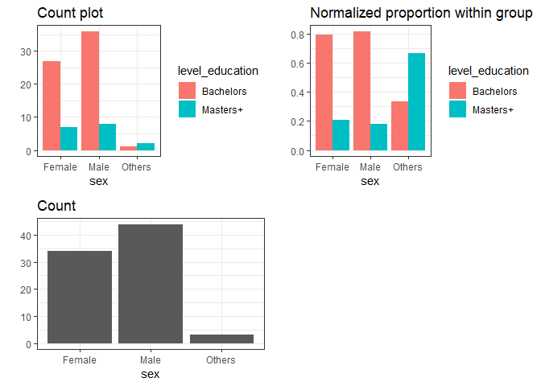
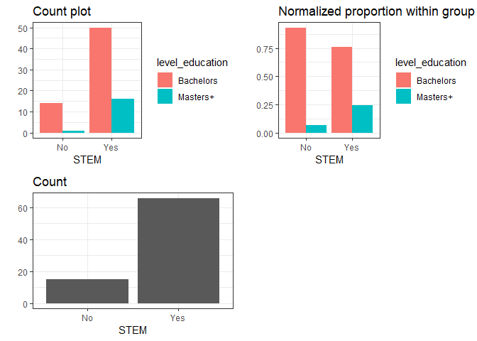
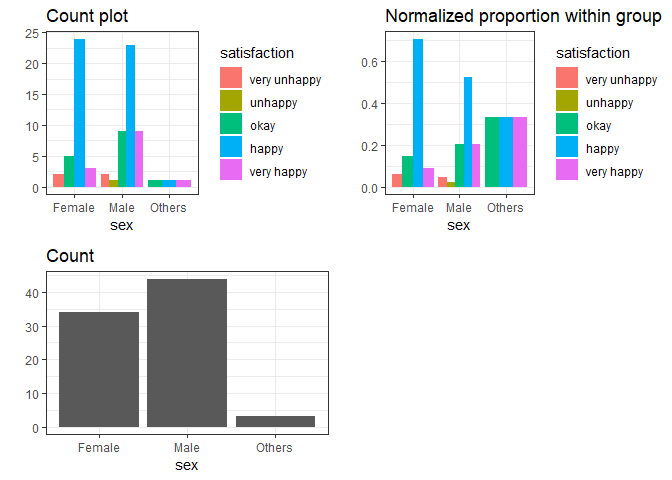
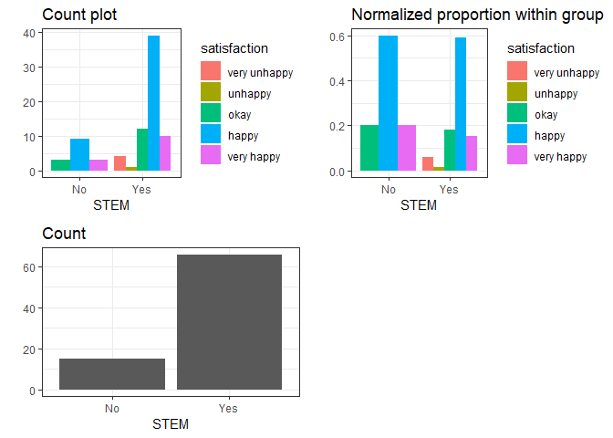

Report Draft
================

## Introduction

Our study explores the relationship between a person’s level of
education prior to Master’s of Data Science and their overall
satisfaction of the program. Three potential confounders have been
determined and measured: sex, age and previous STEM background. All
variables are categorical to preserve some level of anoynmity; their
specificities can be viewed below. The analysis will be conducted with
GLM with poisson and ANOVA. These two models would show any variable
level differences as well as differences of categories within variables
if any is to be found. These two models together would be sufficient in
determining the effect of the predictor on the
response.

| sex    | age   | satisfaction | primary\_language | level\_education | STEM | Years\_off\_school |
| :----- | :---- | :----------- | :---------------- | :--------------- | :--- | :----------------- |
| Male   | 26-30 | very happy   | English           | Bachelors        | No   | 3-5                |
| Female | 21-25 | happy        | English           | Masters+         | Yes  | 0-2                |
| Male   | 21-25 | happy        | English           | Bachelors        | Yes  | 0-2                |
| Male   | 26-30 | happy        | English           | Bachelors        | Yes  | 3-5                |
| Male   | 26-30 | happy        | English           | Bachelors        | Yes  | 3-5                |
| Male   | 21-25 | okay         | English           | Bachelors        | Yes  | 0-2                |

Survey Data

## Overall Summary

#### The interaction between predictor and response

``` r
# data_sub
model_overall <- glm(satisfaction_level ~ level_education, data = data_sub, family = 'poisson')
summary(model_overall)
```

    ## 
    ## Call:
    ## glm(formula = satisfaction_level ~ level_education, family = "poisson", 
    ##     data = data_sub)
    ## 
    ## Deviance Residuals: 
    ##      Min        1Q    Median        3Q       Max  
    ## -2.35850   0.06883   0.12950   0.12950   0.68531  
    ## 
    ## Coefficients:
    ##                         Estimate Std. Error z value Pr(>|z|)    
    ## (Intercept)              1.02290    0.07495  13.647   <2e-16 ***
    ## level_educationMasters+  0.03571    0.16133   0.221    0.825    
    ## ---
    ## Signif. codes:  0 '***' 0.001 '**' 0.01 '*' 0.05 '.' 0.1 ' ' 1
    ## 
    ## (Dispersion parameter for poisson family taken to be 1)
    ## 
    ##     Null deviance: 34.316  on 80  degrees of freedom
    ## Residual deviance: 34.268  on 79  degrees of freedom
    ## AIC: 265.54
    ## 
    ## Number of Fisher Scoring iterations: 4

Very naively, we see from the glm output that there is not a significant
difference in people’s satisfaction of MDS between having a bachelors vs
masters or higher education. We recognize that Ordinal Linear Regression
is the better choice for model fitting, but within-function and
environment variable interactions in R prevented us from using `olr`
package further down in our analysis. Thus we made a conscious decision
to use GLM with poisson
assumption.

#### The interaction between predictor, confounder and response

``` r
model_overall_conf <- glm(satisfaction_level ~ sex + age + level_education + STEM, data = data_sub, family = 'poisson')
summary(model_overall_conf)
```

    ## 
    ## Call:
    ## glm(formula = satisfaction_level ~ sex + age + level_education + 
    ##     STEM, family = "poisson", data = data_sub)
    ## 
    ## Deviance Residuals: 
    ##      Min        1Q    Median        3Q       Max  
    ## -2.40336  -0.16582   0.09389   0.21809   0.62996  
    ## 
    ## Coefficients:
    ##                          Estimate Std. Error z value Pr(>|z|)    
    ## (Intercept)              1.049514   0.181516   5.782 7.38e-09 ***
    ## sexMale                 -0.005601   0.140889  -0.040    0.968    
    ## sexOthers                0.105525   0.366422   0.288    0.773    
    ## age26-30                 0.089475   0.149293   0.599    0.549    
    ## age31-35                -0.112378   0.266672  -0.421    0.673    
    ## age35+                   0.155645   0.260735   0.597    0.551    
    ## level_educationMasters+ -0.006716   0.182241  -0.037    0.971    
    ## STEMYes                 -0.072797   0.172832  -0.421    0.674    
    ## ---
    ## Signif. codes:  0 '***' 0.001 '**' 0.01 '*' 0.05 '.' 0.1 ' ' 1
    ## 
    ## (Dispersion parameter for poisson family taken to be 1)
    ## 
    ##     Null deviance: 34.316  on 80  degrees of freedom
    ## Residual deviance: 33.018  on 73  degrees of freedom
    ## AIC: 276.29
    ## 
    ## Number of Fisher Scoring iterations: 4

A little less naively and accounting for potential confounders, there
still is not a significant difference in people’s satisfaction of MDS
between having a bachelors vs masters or higher education.
Interestingly, we can see Simpson’s Paradox at play here with `Masters+`
having a negative relationship now, albeit very slightly, with respect
to the base case.

#### Anova

``` r
Anova(model_overall_conf)
```

    ## Analysis of Deviance Table (Type II tests)
    ## 
    ## Response: satisfaction_level
    ##                 LR Chisq Df Pr(>Chisq)
    ## sex              0.08890  2     0.9565
    ## age              0.91904  3     0.8208
    ## level_education  0.00136  1     0.9706
    ## STEM             0.17516  1     0.6756

Type II ANOVA is used here because the model does not contain any
interactions. This test makes variable level comparisons about the level
of education as a whole. It is good to perform the ANOVA check as the
intercept (having a bachelor’s degree) may have been a significant
factor on the response and we could not have interpreted that from the
GLM t-test. **if the anova actually yielded a signficant result here
then we know for sure bachelor’s was significant??** The ANOVA table
confirms that there is not a significant difference between the full
model without `level_education` and the full model with
`level_education`.

## Confounders vs. Predictor

#### Age

We first explore the interaction between the age and our predictor of
interest.

``` r
Visualization(data_sub, "age", "predictor")
```

    ## Joining, by = "conf"

<!-- -->

As we can observe from the EDA, different age group has distinct pattern
for the proportion distribution of its own education level. For older
people, they are intended to have master degree than younger people.
However, we want to explore these pattern are significantly unique based
on the hypothesis that **if age can significantly influence the
predictor as a confounder**. Given that hypothesis, we set the age lower
than 26 being the control group and there is no significant different
between different age groups given the
p-value.

``` r
m <- glm_reg(data = data_sub, mode = "predictor", conf = "age", output = "summary")
m
```

    ## 
    ## Call:
    ## glm(formula = above_bachelor ~ confonder, family = "poisson", 
    ##     data = data_sub)
    ## 
    ## Deviance Residuals: 
    ##     Min       1Q   Median       3Q      Max  
    ## -1.0690  -0.7184  -0.4714  -0.4714   1.6176  
    ## 
    ## Coefficients:
    ##                Estimate Std. Error z value Pr(>|z|)    
    ## (Intercept)     -2.1972     0.5000  -4.394 1.11e-05 ***
    ## confonder26-30   0.8427     0.6124   1.376   0.1688    
    ## confonder31-35   0.2513     1.1180   0.225   0.8221    
    ## confonder35+     1.6376     0.7071   2.316   0.0206 *  
    ## ---
    ## Signif. codes:  0 '***' 0.001 '**' 0.01 '*' 0.05 '.' 0.1 ' ' 1
    ## 
    ## (Dispersion parameter for poisson family taken to be 1)
    ## 
    ##     Null deviance: 53.082  on 80  degrees of freedom
    ## Residual deviance: 47.619  on 77  degrees of freedom
    ## AIC: 89.619
    ## 
    ## Number of Fisher Scoring iterations: 6

``` r
Anova(glm(satisfaction_level ~ level_education + age, data = data_sub, family = 'poisson'))
```

    ## Analysis of Deviance Table (Type II tests)
    ## 
    ## Response: satisfaction_level
    ##                 LR Chisq Df Pr(>Chisq)
    ## level_education  0.00199  1     0.9644
    ## age              0.94209  3     0.8153

#### Sex

We discover similar results in the sex variable. The ANOVA analysis
confirms that there is no significant contributions to decrease variance
by the `sex`
variable.

``` r
Visualization(data_sub, "sex", "predictor")
```

    ## Joining, by = "conf"

<!-- -->

``` r
m <- glm_reg(data = data_sub, mode = "predictor", conf = "sex", output = "summary")
m
```

    ## 
    ## Call:
    ## glm(formula = above_bachelor ~ confonder, family = "poisson", 
    ##     data = data_sub)
    ## 
    ## Deviance Residuals: 
    ##     Min       1Q   Median       3Q      Max  
    ## -1.1547  -0.6417  -0.6030  -0.6030   1.3316  
    ## 
    ## Coefficients:
    ##                 Estimate Std. Error z value Pr(>|z|)    
    ## (Intercept)      -1.5805     0.3780  -4.181  2.9e-05 ***
    ## confonderMale    -0.1243     0.5175  -0.240    0.810    
    ## confonderOthers   1.1750     0.8018   1.465    0.143    
    ## ---
    ## Signif. codes:  0 '***' 0.001 '**' 0.01 '*' 0.05 '.' 0.1 ' ' 1
    ## 
    ## (Dispersion parameter for poisson family taken to be 1)
    ## 
    ##     Null deviance: 53.082  on 80  degrees of freedom
    ## Residual deviance: 51.024  on 78  degrees of freedom
    ## AIC: 91.024
    ## 
    ## Number of Fisher Scoring iterations: 6

``` r
Anova(glm(satisfaction_level ~ level_education + sex, data = data_sub, family = 'poisson'))
```

    ## Analysis of Deviance Table (Type II tests)
    ## 
    ## Response: satisfaction_level
    ##                 LR Chisq Df Pr(>Chisq)
    ## level_education 0.033691  1     0.8544
    ## sex             0.047104  2     0.9767

# DO WE CORRECT FOR BONFOURRONI HERE???

#### STEM

Similar results are shown for
`STEM`.

``` r
Visualization(data_sub, "STEM", "predictor")
```

    ## Joining, by = "conf"

<!-- -->

``` r
m <- glm_reg(data = data_sub, mode = "predictor", conf = "STEM", output = "summary")
m
```

    ## 
    ## Call:
    ## glm(formula = above_bachelor ~ confonder, family = "poisson", 
    ##     data = data_sub)
    ## 
    ## Deviance Residuals: 
    ##     Min       1Q   Median       3Q      Max  
    ## -0.6963  -0.6963  -0.6963  -0.3651   1.8840  
    ## 
    ## Coefficients:
    ##              Estimate Std. Error z value Pr(>|z|)   
    ## (Intercept)    -2.708      1.000  -2.708  0.00677 **
    ## confonderYes    1.291      1.031   1.252  0.21041   
    ## ---
    ## Signif. codes:  0 '***' 0.001 '**' 0.01 '*' 0.05 '.' 0.1 ' ' 1
    ## 
    ## (Dispersion parameter for poisson family taken to be 1)
    ## 
    ##     Null deviance: 53.082  on 80  degrees of freedom
    ## Residual deviance: 50.762  on 79  degrees of freedom
    ## AIC: 88.762
    ## 
    ## Number of Fisher Scoring iterations: 6

``` r
Anova(glm(satisfaction_level ~ level_education + STEM, data = data_sub, family = 'poisson'))
```

    ## Analysis of Deviance Table (Type II tests)
    ## 
    ## Response: satisfaction_level
    ##                 LR Chisq Df Pr(>Chisq)
    ## level_education 0.096548  1     0.7560
    ## STEM            0.299714  1     0.5841

## Confounders VS Response

#### Age

``` r
Visualization(data_sub, "age", "response")
```

    ## Joining, by = "predictor"

<!-- -->

##### H0: Age cannot significantly influence the response as a confunder

``` r
m_age <- glm_reg(data = data_sub, mode = "response", conf = "age", output = "summary")
m_age
```

    ## 
    ## Call:
    ## glm(formula = satisfaction_level ~ confonder, family = "poisson", 
    ##     data = data_sub)
    ## 
    ## Deviance Residuals: 
    ##     Min       1Q   Median       3Q      Max  
    ## -2.4230  -0.0812   0.1828   0.1828   0.5885  
    ## 
    ## Coefficients:
    ##                Estimate Std. Error z value Pr(>|z|)    
    ## (Intercept)     0.99119    0.10153   9.762   <2e-16 ***
    ## confonder26-30  0.08568    0.14594   0.587    0.557    
    ## confonder31-35 -0.10389    0.26293  -0.395    0.693    
    ## confonder35+    0.15394    0.23614   0.652    0.514    
    ## ---
    ## Signif. codes:  0 '***' 0.001 '**' 0.01 '*' 0.05 '.' 0.1 ' ' 1
    ## 
    ## (Dispersion parameter for poisson family taken to be 1)
    ## 
    ##     Null deviance: 34.316  on 80  degrees of freedom
    ## Residual deviance: 33.328  on 77  degrees of freedom
    ## AIC: 268.6
    ## 
    ## Number of Fisher Scoring iterations: 4

Given p-value of all three groups of age are larger than 0.05, we cannot
reject the null hypothesis. Therfore, age group 21-25 has no significant
diffrent with other age groups and age cannot significantly influence
the response as a
confunder.

#### Sex

``` r
Visualization(data_sub, "sex", "response")
```

    ## Joining, by = "predictor"

<!-- -->

##### H0: Sex cannot significantly influence the response as a confunder

``` r
m_sex <- glm_reg(data = data_sub, mode = "response", conf = "sex", output = "summary")
m_sex
```

    ## 
    ## Call:
    ## glm(formula = satisfaction_level ~ confonder, family = "poisson", 
    ##     data = data_sub)
    ## 
    ## Deviance Residuals: 
    ##     Min       1Q   Median       3Q      Max  
    ## -2.3741   0.0000   0.1072   0.1396   0.6959  
    ## 
    ## Coefficients:
    ##                 Estimate Std. Error z value Pr(>|z|)    
    ## (Intercept)      1.01693    0.10314   9.860   <2e-16 ***
    ## confonderMale    0.01916    0.13676   0.140    0.889    
    ## confonderOthers  0.08168    0.34893   0.234    0.815    
    ## ---
    ## Signif. codes:  0 '***' 0.001 '**' 0.01 '*' 0.05 '.' 0.1 ' ' 1
    ## 
    ## (Dispersion parameter for poisson family taken to be 1)
    ## 
    ##     Null deviance: 34.316  on 80  degrees of freedom
    ## Residual deviance: 34.254  on 78  degrees of freedom
    ## AIC: 267.52
    ## 
    ## Number of Fisher Scoring iterations: 4

Given p-value of two groups of sex are larger than 0.05, we cannot
reject the null hypothesis. Therfore, Female group has no significant
different with other groups and sex cannot significantly influence the
response as a
confunder.

#### STEM

``` r
Visualization(data_sub, "STEM", "response")
```

    ## Joining, by = "predictor"

<!-- -->

##### H0: STEM cannot significantly influence the response as a confunder

``` r
m_stem <- glm_reg(data = data_sub, mode = "response", conf = "STEM", output = "summary")
m_stem
```

    ## 
    ## Call:
    ## glm(formula = satisfaction_level ~ confonder, family = "poisson", 
    ##     data = data_sub)
    ## 
    ## Deviance Residuals: 
    ##     Min       1Q   Median       3Q      Max  
    ## -2.3484   0.0000   0.1439   0.1439   0.7005  
    ## 
    ## Coefficients:
    ##              Estimate Std. Error z value Pr(>|z|)    
    ## (Intercept)   1.09861    0.14907   7.370 1.71e-13 ***
    ## confonderYes -0.08426    0.16648  -0.506    0.613    
    ## ---
    ## Signif. codes:  0 '***' 0.001 '**' 0.01 '*' 0.05 '.' 0.1 ' ' 1
    ## 
    ## (Dispersion parameter for poisson family taken to be 1)
    ## 
    ##     Null deviance: 34.316  on 80  degrees of freedom
    ## Residual deviance: 34.065  on 79  degrees of freedom
    ## AIC: 265.33
    ## 
    ## Number of Fisher Scoring iterations: 4

Given p-value of STEM are larger than 0.05, we cannot reject the null
hypothesis. Therfore, STEMNo group has no significant different with the
other group and STEM cannot significantly influence the response as a
confunder.

## Results

Our analysis found no indication that the level of education one has
prior to attending MDS is associated with their satisfaction of the
program. In order to derive the role of the predictor on the response in
its purest form, we collected potential confounders: age, sex and
previous STEM degree. These three variables are all plausible in having
an effect on both the predictor and response variables. But as shown
through our ANOVA analysis, none of them turned out to be significant.

There are pros and cons with our approach to our first observational
study. We did well in making this study as causal as possible by
adhering to sound statistical procedures during the analysis phase. We
made sure each step in our model making decision is justified and
intentional. A good example of this includes using GLM instead of
Ordinal Linear Regression even though the latter is more logical in this
case; environment variable interactions in R prevented us from using the
newer `olr` package. The decision to use Type II ANOVA and GLM t-tests
to double check results is another example.

However, being the pilot study, there were mistakes on many fronts in
terms of experimental design and implementation. Most egregiously, we
made the very amateur mistake of posting the same link to our Slack
channel twice resulting in a survey participation much greater than our
classroom population. This failure in data collection could very well
have doomed our analysis right from the beginning. Due to potential
decline in social reputation, we did not ask our class to partake in our
survey a third time. A more serious shortcoming is that our initial
experimental design was not centered on a single predictive variable and
its potential confounders but based instead on collecting a host of
related variables with the expectation of performing ANOVA to determine
the true predictive variable post-hoc during the analytical phase. This
is fundamentally not a causal study. We made revisions to our initial
proposal upon realizing this but that was post data collection. And
therefore the effect of poor framing on our study conclusion is also
non-insignificant. A causal study does not inherently involve fancier
tests or advanced analysis, it is more determined during the
experimental setup. In a future study, we would like to clearly identify
a likely predictor and then framing around this predictor its potential
confounders. Only by being rigorous and testing a very specific
hypothesis can a direct causal relationship be established. Although
there are limitations for observational studies at our current level of
education, our analysis would benefit immensely from carrying out a
cleaner, more methodical experimental setup.
