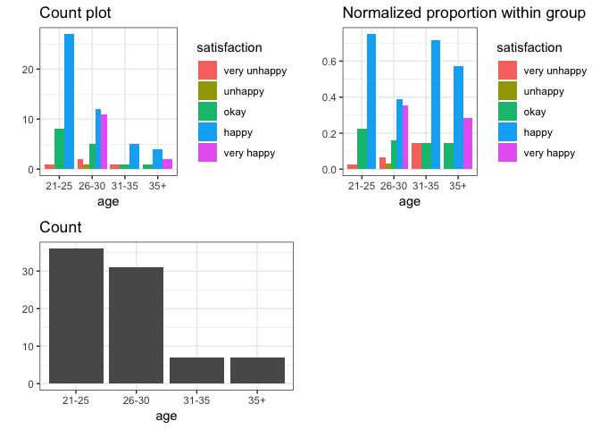

Report Draft
================

Our study is based on whether people’s background influence their
satisfaction of the MDS project. The background includes people’s
gender, age, whether their primary language is English, their level of
education and the year our of school before they enter the project.

## Overall Summary

if using `glm` to go through all the variables in both interactive and
non-interactive way.

#### When all the variables are interactive with each other.

``` r
# data_sub

model_overall <- glm(satisfaction_level ~ sex * age * primary_language * level_education * STEM * Years_off_school, data = data_sub, family = 'poisson')
# summary(model_overall)
```

#### When all the variables are not interactive with each other.

``` r
model_overall <- glm(satisfaction_level ~ sex + age + primary_language + level_education + STEM + Years_off_school, data = data_sub, family = 'poisson')
summary(model_overall)
```

    ## 
    ## Call:
    ## glm(formula = satisfaction_level ~ sex + age + primary_language + 
    ##     level_education + STEM + Years_off_school, family = "poisson", 
    ##     data = data_sub)
    ## 
    ## Deviance Residuals: 
    ##      Min        1Q    Median        3Q       Max  
    ## -2.45730  -0.23103   0.07144   0.30566   0.71062  
    ## 
    ## Coefficients:
    ##                          Estimate Std. Error z value Pr(>|z|)    
    ## (Intercept)              1.084860   0.190150   5.705 1.16e-08 ***
    ## sexMale                 -0.008704   0.147468  -0.059    0.953    
    ## sexOthers                0.092572   0.368644   0.251    0.802    
    ## age26-30                 0.089834   0.219409   0.409    0.682    
    ## age31-35                -0.180340   0.314680  -0.573    0.567    
    ## age35+                  -0.110466   0.441950  -0.250    0.803    
    ## primary_languageOther   -0.091431   0.168946  -0.541    0.588    
    ## level_educationMasters+  0.042989   0.197653   0.217    0.828    
    ## STEMYes                 -0.067934   0.187422  -0.362    0.717    
    ## Years_off_school3-5     -0.040975   0.208462  -0.197    0.844    
    ## Years_off_school5-10     0.006920   0.286731   0.024    0.981    
    ## Years_off_school10+      0.288349   0.433683   0.665    0.506    
    ## ---
    ## Signif. codes:  0 '***' 0.001 '**' 0.01 '*' 0.05 '.' 0.1 ' ' 1
    ## 
    ## (Dispersion parameter for poisson family taken to be 1)
    ## 
    ##     Null deviance: 34.316  on 80  degrees of freedom
    ## Residual deviance: 32.007  on 69  degrees of freedom
    ## AIC: 283.28
    ## 
    ## Number of Fisher Scoring iterations: 5

# Overall summary based on ordinal regression

## Individual explainatory variable

Based on the EDA in last milestone, we include the predictors that has
distinct patterns and hope we can find the explainatory variable that
gives significant impact towards the response.

#### Age

As we can observe from the EDA, after we normalize the data and make the
normalized proportion plot, there is no significant difference that we
can discover among different groups. Our statistic resluts also further
prove this observation. For example, given the hypothesis that **if the
younger people have higher level of satisfication**, we set the age
lower than 26 being the control group and there is no significant
different between different age groups given the
p-value.

``` r
Visualization(data_sub, "age")
```

    ## Joining, by = "predictor"

<!-- -->

``` r
model_age <- glm(satisfaction_level ~ age, data = data_sub, family = 'poisson')
summary(model_age)
```

    ## 
    ## Call:
    ## glm(formula = satisfaction_level ~ age, family = "poisson", data = data_sub)
    ## 
    ## Deviance Residuals: 
    ##     Min       1Q   Median       3Q      Max  
    ## -2.4230  -0.0812   0.1828   0.1828   0.5885  
    ## 
    ## Coefficients:
    ##             Estimate Std. Error z value Pr(>|z|)    
    ## (Intercept)  0.99119    0.10153   9.762   <2e-16 ***
    ## age26-30     0.08568    0.14594   0.587    0.557    
    ## age31-35    -0.10389    0.26293  -0.395    0.693    
    ## age35+       0.15394    0.23614   0.652    0.514    
    ## ---
    ## Signif. codes:  0 '***' 0.001 '**' 0.01 '*' 0.05 '.' 0.1 ' ' 1
    ## 
    ## (Dispersion parameter for poisson family taken to be 1)
    ## 
    ##     Null deviance: 34.316  on 80  degrees of freedom
    ## Residual deviance: 33.328  on 77  degrees of freedom
    ## AIC: 268.6
    ## 
    ## Number of Fisher Scoring iterations: 4

#### Sex

We discover similar results in the sex
variable.

``` r
Visualization(data_sub, "sex")
```

    ## Joining, by = "predictor"

<!-- -->

``` r
model_sex <- glm(satisfaction_level ~ sex, data = data_sub, family = 'poisson')
summary(model_sex)
```

    ## 
    ## Call:
    ## glm(formula = satisfaction_level ~ sex, family = "poisson", data = data_sub)
    ## 
    ## Deviance Residuals: 
    ##     Min       1Q   Median       3Q      Max  
    ## -2.3741   0.0000   0.1072   0.1396   0.6959  
    ## 
    ## Coefficients:
    ##             Estimate Std. Error z value Pr(>|z|)    
    ## (Intercept)  1.01693    0.10314   9.860   <2e-16 ***
    ## sexMale      0.01916    0.13676   0.140    0.889    
    ## sexOthers    0.08168    0.34893   0.234    0.815    
    ## ---
    ## Signif. codes:  0 '***' 0.001 '**' 0.01 '*' 0.05 '.' 0.1 ' ' 1
    ## 
    ## (Dispersion parameter for poisson family taken to be 1)
    ## 
    ##     Null deviance: 34.316  on 80  degrees of freedom
    ## Residual deviance: 34.254  on 78  degrees of freedom
    ## AIC: 267.52
    ## 
    ## Number of Fisher Scoring iterations: 4

####
